<div align="center">


# 🎬 CineVault

### <span style="color:#D49352">A private, local-first home for films, series, seasons, and episodes.</span>

[](https://react.dev/)
[](https://vite.dev/)
[](https://expressjs.com/)
[](https://sqlite.org/)
[](#license)

</div>

> [!NOTE]
> CineVault is designed for personal or trusted private hosting. It does not include public account registration.

> [!IMPORTANT]
> Never commit `backend/.env`, `frontend/.env`, the SQLite database, exports, logs, backups, or recovery folders. Before publishing this repository, use placeholder `.env.example` files, rotate any password that has ever been committed, and remove tracked secret files with `git rm --cached backend/.env frontend/.env`.

## Contents

- [What CineVault does](#-what-cinevault-does)
- [User interface and workflows](#-user-interface-and-workflows)
- [System architecture](#️-system-architecture)
- [Data model and integrity rules](#-data-model-and-integrity-rules)
- [Storage, backup, and disaster recovery](#️-storage-backup-and-disaster-recovery)
- [Logging and Activity](#-logging-and-activity)
- [Local installation](#-local-installation)
- [Configuration reference](#️-configuration-reference)
- [Commands](#-commands)
- [Testing and release checks](#-testing-and-release-checks)
- [API reference](#-api-reference)
- [Private internet hosting on Amazon EC2](#-private-internet-hosting-on-amazon-ec2)
- [Complete EC2 rebuild after instance loss](#8-complete-ec2-rebuild-after-instance-loss)
- [Updating and rolling back](#-updating-and-rolling-back)
- [Troubleshooting](#-troubleshooting)
- [Project layout](#-project-layout)

---

## ✨ What CineVault does

CineVault organizes movies and episodic series in one searchable library. It stores metadata, viewing history, country-specific classifications, genres and subgenres, watch sources, posters, trailers, seasons, and individual episode runtimes.

<table>
<tr><td>🎞️ <b>Movies</b></td><td>Feature films, featurettes, shorts, television films, television specials, and interactive films</td></tr>
<tr><td>📺 <b>Series</b></td><td>Regular, limited, and anthology series → seasons → episodes with per-episode runtimes and watch histories</td></tr>
<tr><td>🌍 <b>Regional metadata</b></td><td>Origin countries and territory-specific content ratings</td></tr>
<tr><td>🧭 <b>Discovery</b></td><td>Search, favorites, watch-later views, sorting, and server pagination</td></tr>
<tr><td>🔔 <b>Media health</b></td><td>Poster and trailer checks with notifications that focus the affected library entry</td></tr>
<tr><td>🛟 <b>Data safety</b></td><td>SQLite transactions, verified backups, JSON exports, audit history, and recoverable trash</td></tr>
</table>

## 🧭 User interface and workflows

| Surface | Behavior |
|---|---|
| **Library** | Every active movie and series, watched or not watched |
| **Movies** | Watched movie entries only |
| **Series** | Every active series entry |
| **Favorites** | Entries marked as favorites |
| **Watch Later** | Entries that have not yet been watched |
| **Statistics** | Server-calculated library, runtime, country, genre, presentation, rating, watch-activity, weekday, growth, and episodic reports |
| **Notifications** | Unresolved poster/trailer problems; selecting one focuses its title without opening the editor automatically |
| **Trash** | Recoverable deleted entries, with restore and backup-protected permanent deletion |
| **Data Health** | Missing/inconsistent metadata, invalid URLs, incomplete series, duplicates, and reviewable canonical merges |
| **Activity** | Searchable, filterable, expandable audit events with JSON/CSV page export |

Library results are fetched with server pagination rather than loading the full database into the browser. Search covers titles, original titles, directors or whole-series credits, cast or voice cast, production companies, and summaries through SQLite FTS5. Filters support content type, subtype, lifecycle, calculated viewing status, presentation form, genre/subgenre, language, country, rating, award, tag, year, production company, watch method/provider, and content-link domain. Selecting several filter values is strict `AND` matching. Filter presets, display mode, and table columns are stored in the current browser only.

The library can be displayed as spacious cards, compact cards, or an audit-oriented table. The table supports column selection, keyboard row navigation, cross-page title selection, and reviewed bulk changes to production or release status. Table selections remain active while paging and can be exported together. Every delete action requires confirmation; permanent deletion additionally requires the exact title and creates a verified recovery backup first.

The editor progressively enables metadata based on lifecycle and viewing state. Unavailable fields remain visible with explanatory messages. A watched movie requires a release date and at least one watch-timeline event. Series viewing is derived only from episode watch histories. “Where to find this movie/series” stores repeatable HTTP(S) URLs and displays normalized domains; watch sources store a viewing method separately from an optional provider.

## 🖼️ Preview

<div align="center">

### Your private screening room

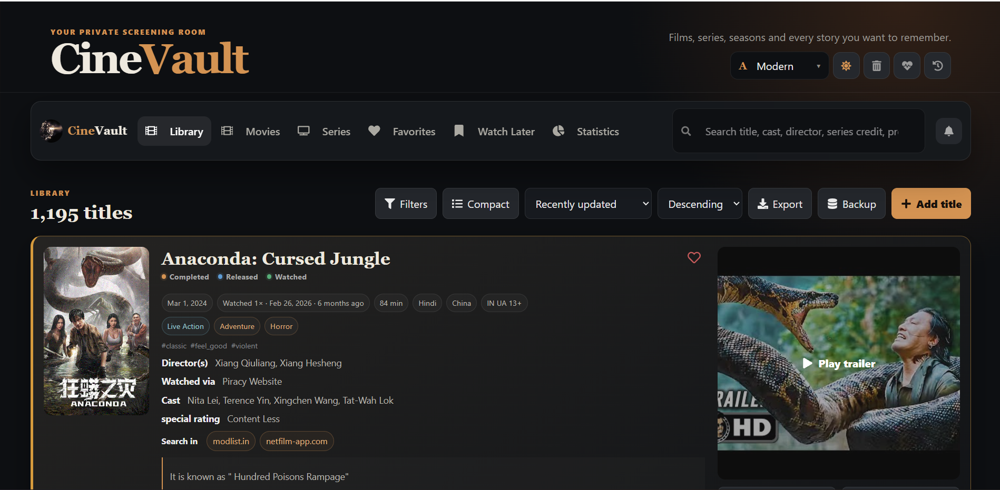

<sub>The complete library combines lifecycle, viewing history, classifications, metadata, source links, posters, and trailers in one card-oriented view.</sub>

</div>

### Browse the collection

<table>
<tr>
<td width="50%" align="center">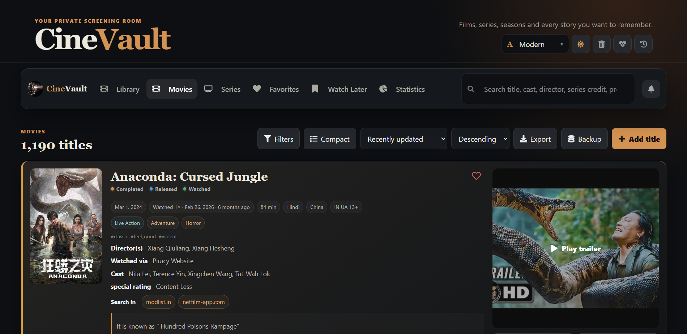<br /><sub><b>Watched movies</b> — movie-only browsing with the same rich metadata cards.</sub></td>
<td width="50%" align="center">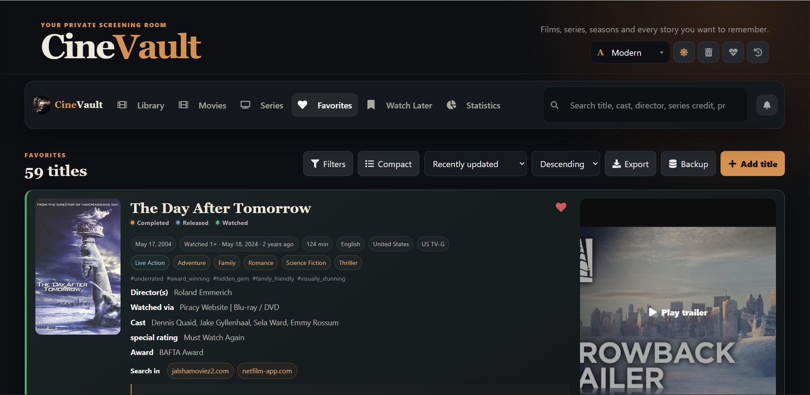<br /><sub><b>Favorites</b> — a focused collection of personally marked titles.</sub></td>
</tr>
<tr>
<td width="50%" align="center">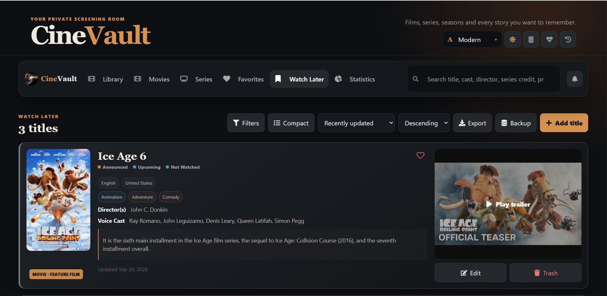<br /><sub><b>Watch Later</b> — unreached titles kept ready for future viewing.</sub></td>
<td width="50%" align="center">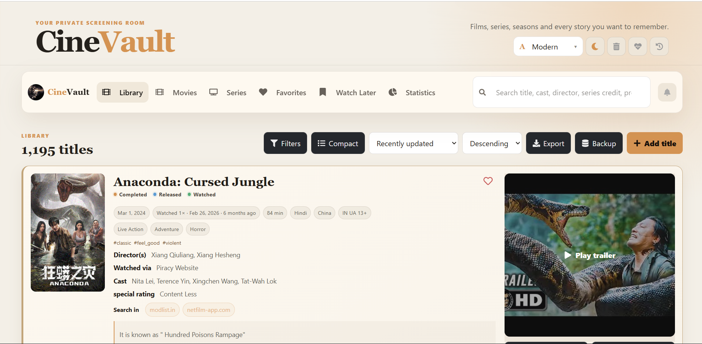<br /><sub><b>Light theme</b> — the full interface with a warmer high-contrast palette.</sub></td>
</tr>
</table>

### Understand the library

<p align="center">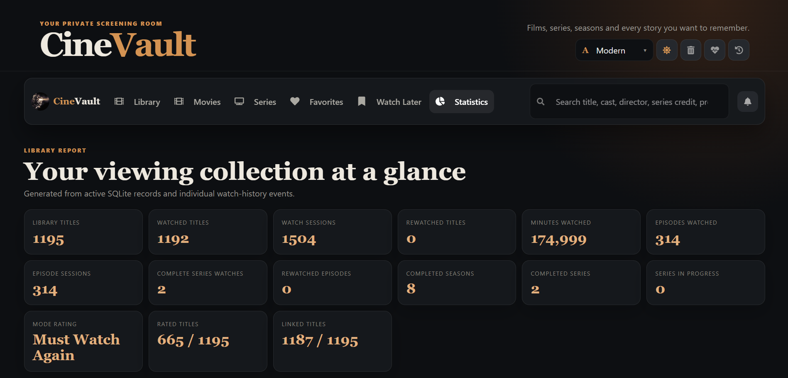</p>

<table>
<tr>
<td width="50%" align="center">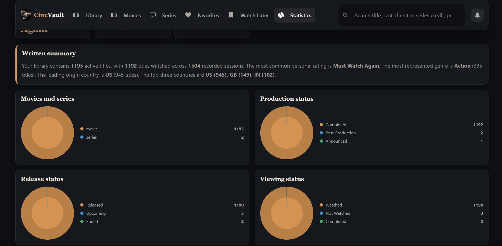<br /><sub><b>Library distributions</b> — type, lifecycle, viewing state, genre, presentation, and country analysis.</sub></td>
<td width="50%" align="center">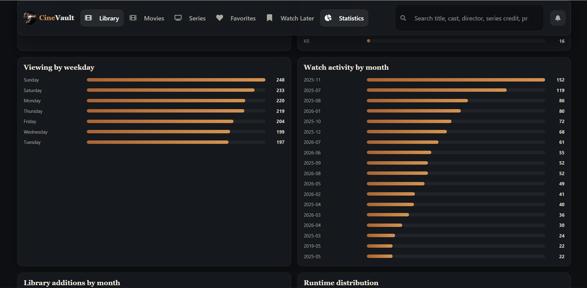<br /><sub><b>Activity and metadata</b> — watch patterns, growth, runtime, ratings, sources, and linked domains.</sub></td>
</tr>
</table>

### Maintain and audit data

<table>
<tr>
<td width="50%" align="center">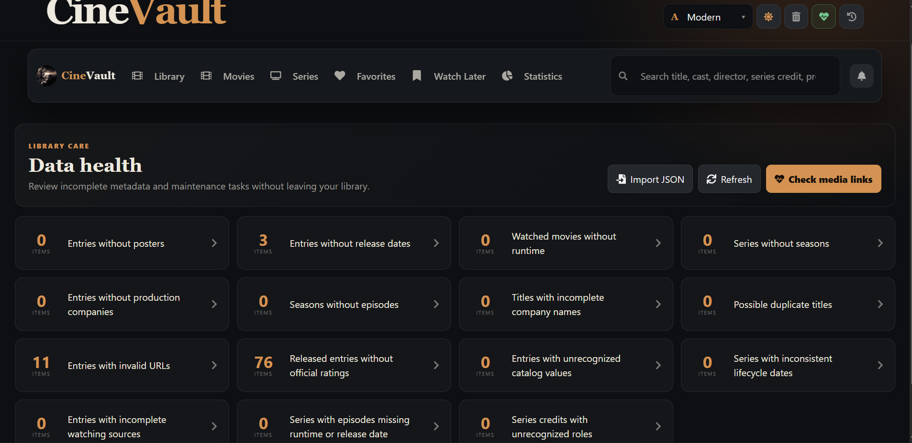<br /><sub><b>Data Health</b> — actionable completeness, consistency, and canonicalization checks.</sub></td>
<td width="50%" align="center">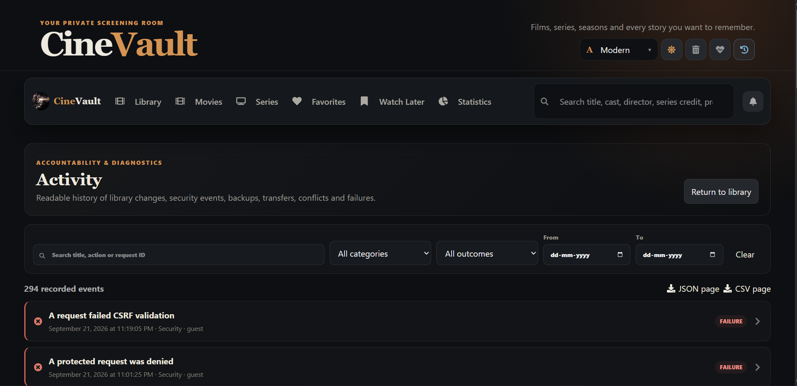<br /><sub><b>Activity</b> — readable, filterable operational and library audit history.</sub></td>
</tr>
<tr>
<td width="50%" align="center">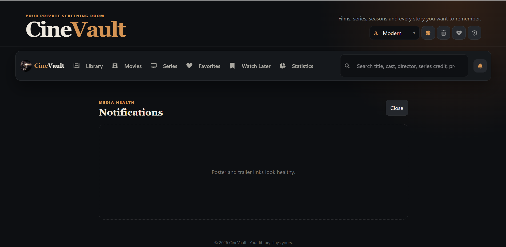<br /><sub><b>Notifications</b> — unresolved poster and trailer problems without interrupting browsing.</sub></td>
<td width="50%" align="center">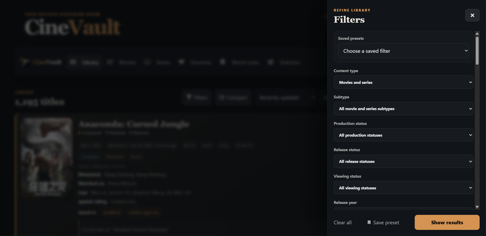<br /><sub><b>Advanced filters</b> — strict multi-value filtering with reusable browser-local presets.</sub></td>
</tr>
</table>

### Add and edit titles

<p align="center">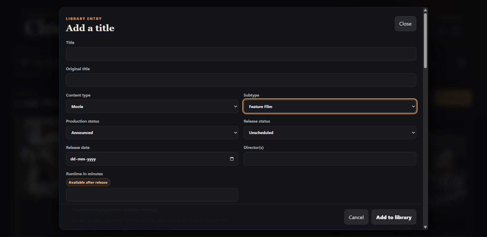</p>

<p align="center"><sub>The lifecycle-aware editor keeps controlling fields first and explains metadata that is not yet applicable.</sub></p>

## 🏗️ System architecture

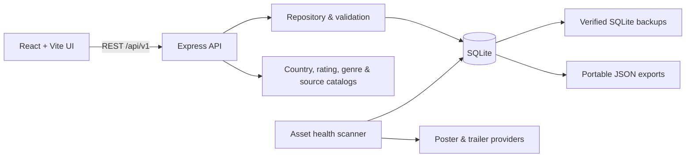

### Data hierarchy

```text
Content
├── Movie
└── Series
    └── Season
        └── Episode
```

- Movie runtime is stored directly.
- Episode runtime is stored on each episode.
- Season and series runtimes are calculated from known episode runtimes.

### Lifecycle and credits

CineVault keeps three different concepts separate so one label never has to mean several things:

- **Production status** records creative progress, from Rumored and Announced through Filming / Production, Post-Production, Completed, Canceled, or Shelved.
- **Release status** records public availability. Movies use Unscheduled, Upcoming, Released, Canceled, or Withheld; series and seasons use their appropriate airing lifecycle.
- **Viewing status** is read-only and calculated from watch records. A movie is Watched only when it has a watch-timeline event. Series and season states are calculated from episode watch histories.

Movies retain a Director(s) field. Series instead use repeatable whole-series credits with a person and role, such as Creator, Developer, Showrunner, Executive Producer, Head Writer, or Original Work Creator. Episode directors remain attached to their individual episodes.
- Unknown episode runtimes remain unknown instead of being counted as zero.

## 🧩 Data model and integrity rules

### Content classification

- **Movie subtypes:** Feature Film, Featurette, Short Film, Television Film, Television Special, Interactive Film.
- **Series subtypes:** Regular Series, Limited Series, Anthology Series.
- **Presentation forms:** type-specific forms such as Live Action, Animation, Anime, Documentary, Experimental, Silent, Reality, Talk, Game/Competition, Variety, News, Educational, Concert, or Compilation.
- **Genres:** maintained parent genres and subgenres. Selecting a subgenre replaces its parent so the same classification is not stored redundantly.
- **Tags:** descriptive properties that are not already represented by subtype, presentation form, or genre.

### Status fields

| Scope | Production status | Release status | Calculated viewing status |
|---|---|---|---|
| Movie | Rumored, Announced, In Development, Pre-Production, Filming / Production, Post-Production, Completed, Canceled, Shelved | Unscheduled, Upcoming, Released, Canceled, Withheld | Not Watched or Watched |
| Series | Same production catalog | Unscheduled, Upcoming, Airing, Between Seasons, Hiatus, Returning, Ended, Canceled | Not Started, In Progress, or Completed |
| Season | Same production catalog | Unscheduled, Upcoming, Airing, Released, Canceled | Not Started, In Progress, or Completed from episode histories |

Viewing status is never accepted as an editable source of truth. Movies are watched when their watch timeline is non-empty. A season is complete when every existing episode has at least one watch event. A series is complete when every existing episode across every season has at least one watch event. A full-series watch count is the minimum episode-watch count across all existing episodes.

### Series hierarchy

Each season stores its number, title, production status, release status, premiere date, poster URL, synopsis, timestamps, and calculated completion state. Each episode stores its number, title, type, release/air date, runtime, director names, summary, playback progress, timestamps, and repeatable watch history. Missing titles default to `Season N` and `Episode N`. Season and episode numbers must be unique inside their parent. Changing a season premiere can populate its episode release dates through the editor’s reviewed update behavior.

Supported episode types include Regular, Pilot, Backdoor Pilot, Season Premiere, Midseason Premiere, Midseason Finale, Season Finale, Series Finale, Special, Holiday Special, Recap, Clip Show, Crossover, Two-Part Episode, Bonus, Webisode, Minisode, and Unaired Episode.

### Dates, identity, and runtime

- A title’s database identity is **content type + normalized title + release date**. A movie and series with the same title/date are distinct.
- Real-calendar validation is performed by the backend; impossible and future dates/times are rejected.
- A watch date may equal its release date, but cannot be earlier.
- Series end date must be later than its release date and is required for an Ended series.
- Episode release dates cannot precede the series release date or their season premiere.
- Runtime must be a positive whole number when supplied.
- Movie viewing minutes equal runtime × watch-event count.
- Series minutes are calculated from every episode runtime × that episode’s watch-event count.
- Release-date sorting excludes entries whose release date is empty. Watch-date sorting excludes unwatched entries.
- Title sorting uses a deterministic natural order: symbols, numbers, then A–Z ascending; descending is the complete reverse.

### Normalization and relational data

Titles, original titles, directors, cast, production companies, networks, season titles, and episode titles remove leading/trailing whitespace and collapse unintended repeated spaces. Comma-separated people and network values normalize each item independently. Animation entries display cast as voice cast, and legacy `(v)` markers are removed.

Production companies use canonical relational records plus searchable aliases and a many-to-many content link. Full corporate names remain the canonical stored value. Data Health suggests—but never automatically performs—possible merges. Countries are stored as stable ISO-style codes and displayed as names. Official ratings retain territory, authority, code, and any historical classification metadata, with at most one rating per territory.

Primary application tables include `content_items`, `seasons`, `episodes`, `watch_history`, `episode_watch_history`, `content_links`, `production_companies`, `production_company_aliases`, `content_production_companies`, `series_credits`, `notifications`, `asset_checks`, `audit_log`, and `schema_migrations`. SQLite FTS5 maintains the `content_search` index and its internal support tables.

## 🗄️ Storage, backup, and disaster recovery

The active library lives at:

```text
backend/data/movie-tracker.sqlite
```

This file is excluded from Git because Git tracks application code—not changing live data.

### Fresh installation behavior

When a repository is cloned without personal data, the first backend start creates only the minimum runtime state:

```text
backend/data/
└── movie-tracker.sqlite
```

The database contains the current empty schema and is ready for new entries. A clean installation does **not** create historical migration snapshots, migration reports, migration-completion log or Activity records, an empty `backups/` directory, or an empty `exports/` directory. Migration events remain enabled when an existing database genuinely requires an upgrade.

Artifact directories are created only when they are needed:

| Path | First created when |
|---|---|
| `backend/data/backups/` | A manual or website backup is requested, or a data-changing operation requires a recovery snapshot |
| `backend/data/exports/` | JSON data is exported or a genuine legacy import writes its migration report |
| `backend/data/server.lock` | The API server is running |

If `MOVIE_TRACKER_DATA_DIR` is configured, the same behavior applies under that directory instead of `backend/data`.

### Optional legacy JSON import

Only when `backend/movies.json` exists and no SQLite database has already been initialized, CineVault:

1. Creates the SQLite schema.
2. Archives `backend/movies.json` with a timestamp.
3. Imports every legacy record while preserving its UUID.
4. Runs `PRAGMA integrity_check`.
5. Writes a JSON migration report under `backend/data/exports/`.

### Backup, export, and restore

Run these commands inside `backend`:

```bash
npm run backup
npm run export
npm run restore -- "path/to/verified-backup.sqlite"
npm run decrypt-backup -- "path/to/backup.sqlite.cvbackup" "path/to/recovered.sqlite"
```

Terminal backups are named `manual.<timestamp>.sqlite`. Backups requested from the website are named `automatic.<timestamp>.sqlite`; “automatic” identifies the source and retention class—it is not a continuously running scheduler. Migration, merge, import, permanent-delete, and restore operations create purpose-labelled recovery snapshots when required.

The restore command:

1. Refuses to operate while the backend lock identifies a live API process.
2. Runs `PRAGMA integrity_check` against the requested source.
3. Preserves the current database and any WAL/SHM sidecars.
4. Detaches the old sidecars so they cannot be applied to a different database image.
5. Installs the verified source and records a restore audit event.

Always stop the backend before restoring. Never copy only `movie-tracker.sqlite` from a running WAL-mode database; create a verified application backup instead.

> [!IMPORTANT]
> Use Git to restore source code. Use SQLite backups or exports to restore library data.

Backup retention defaults to the latest 10 manual snapshots, one automatic snapshot per day for 30 days, and one automatic snapshot per month for 12 months. The same calendar policy applies to encrypted mirror copies. Migration, pre-delete, and pre-restore snapshots are never pruned automatically. To create encrypted off-device copies, set `BACKUP_MIRROR_DIR` to an absolute folder on another drive or a private synchronized folder and set `BACKUP_ENCRYPTION_PASSPHRASE` to a long passphrase. Mirrored files use an authenticated AES-256-GCM envelope with a unique salt and nonce; the server verifies every encrypted copy immediately. The passphrase is never written to a backup or log. Keep it in a password manager because an encrypted backup cannot be recovered without it.

Example environment configuration:

```dotenv
BACKUP_MIRROR_DIR=D:\CineVault-Backups
BACKUP_ENCRYPTION_PASSPHRASE=replace-with-a-long-unique-secret
MANUAL_BACKUP_RETENTION=10
AUTOMATIC_DAILY_RETENTION_DAYS=30
AUTOMATIC_MONTHLY_RETENTION_MONTHS=12
```

Google Drive for desktop can be used without granting CineVault Google-account credentials: choose a synchronized or mirrored Drive folder as `BACKUP_MIRROR_DIR`. CineVault encrypts the backup locally before the Drive client uploads it.

On a headless EC2 server, use the maintained `rclone` systemd service and timer under `deploy/systemd`. CineVault still performs the database backup, encryption, and immediate verification; rclone receives only `.cvbackup` ciphertext from the local outbox. Never mount Google Drive as `MOVIE_TRACKER_DATA_DIR` and never place the live SQLite database in a synchronized directory.

The restore command checks `backend/data/server.lock` and refuses to replace the database while the API process is active.

### Recovery procedure

1. Stop the API cleanly with `Ctrl+C` or `sudo systemctl stop cinevault`.
2. Preserve the entire current `backend/data` directory before attempting repair.
3. Choose the newest backup that passes `PRAGMA integrity_check`.
4. Run `npm run restore -- "path/to/backup.sqlite"` inside `backend`.
5. Run `npm run backup` immediately to create a new verified checkpoint.
6. Start the API and verify counts, recent entries, Trash, watch histories, seasons, and episodes.

The current live database is always `backend/data/movie-tracker.sqlite`. Files beginning with `manual`, `automatic`, `pre-`, or containing `before-restore` are recovery artifacts, not the active database. Git can recover source code but cannot recover uncommitted SQLite data.

### Portable JSON export and import

The website Export button offers two formats:

- **Complete recovery export** retains database IDs, relationship IDs, creation/update timestamps, and every movie, series, season, episode, watch record, source, link, company, rating, and credit detail.
- **Clean transferable export** retains the same library information in nested movie/series objects while omitting database-specific IDs and internal timestamps. Importing it generates fresh IDs and can build an equivalent CineVault library.

Exports are scoped to the immediate library view. Library, Movies, Series, Favorites, Watch Later, and Trash export only the titles belonging to that tab after the current search, filters, and sorting are applied—not merely the visible pagination page. In table view, selecting titles overrides the view scope; selections persist across pages and only those selected titles are exported. Both formats remain importable. An exported Trash entry is deliberately restored as an active title on import because a safety export should recover the title rather than reproduce its pending-deletion state. Export is unavailable when the current scope contains no titles.

`npm run export` continues to create a complete whole-library export for command-line recovery workflows. Data Health validates every title before import, including chronology, calendar dates, lifecycle rules, URLs, runtimes, classifications, and nested series data. The preview separates valid and invalid titles, explains each rejected title, identifies conflicts using content type + normalized title + release date, and labels the file as a full-library or partial export. Import offers two reviewed strategies: **Keep existing and add new** leaves matching active or trashed entries unchanged and inserts only new valid identities; **Replace current library** requires every imported title to be valid, creates a verified backup, clears Library and Trash, and rebuilds the active library from the file. Replacing with a filtered, tab-scoped, focused, or selected-title export additionally requires the exact typed phrase `REPLACE WITH SUBSET`; the backend independently enforces the same requirement. Applying either strategy runs as one transaction, so any unexpected failure rolls back the complete attempt rather than leaving a partial library.

## 🔔 Poster and trailer health

The health scanner checks a bounded group of external assets and updates the notification center:

```bash
cd backend
npm run check-assets -- --limit=50
```

The client connection scan consults the persistent `asset_checks` table and checks only URLs that are new, changed, or older than the configured scan age. This survives server restarts and avoids rescanning the library for every connection. The command above remains available for an explicit bounded scan. A notification focuses the affected title in the library; editing remains a separate user action.

Temporary provider failures and timeouts remain visible as diagnostic reasons. A production scheduler can require repeated failures before notifying.

## 🧾 Logging and Activity

CineVault maintains two complementary diagnostic records:

- `backend/logs/application.jsonl` contains structured operational events for HTTP requests, startup, migrations, backups, failures, and media-health scans.
- `backend/logs/error.jsonl` contains error-level operational events with correlation IDs and stack traces where appropriate.
- The SQLite `audit_log` table contains immutable business events for content creation, edits, trash actions, favorite changes, notification reads, backups, exports, restores, and media-health state changes.

Every HTTP response includes an `X-Request-Id`. The same identifier appears in operational logs and related audit records, allowing one user action to be traced across both layers. Request bodies, authorization values, cookies, passwords, tokens, and secrets are not written to operational logs.

Operational logs rotate at 10 MB and retain up to five files per stream. Recent audit events can be inspected through:

```text
GET /api/v1/audit?limit=50
GET /api/v1/audit?action=update&entityId=<content-id>
GET /api/v1/audit?outcome=failure
```

Each audit event can include the actor, outcome, changed fields, before/after values, diagnostic metadata, and timestamp.

The Activity page is the user-readable view of `audit_log`. It supports text search, category, outcome, From/To calendar filters, 30-event server pages, expandable changes/details, direct focusing of related content, and JSON or CSV export of the current page. Dates are displayed as a long-form date plus exact local time while the stored ISO timestamp remains suitable for sorting and diagnostics. Categories include Library, Viewing, Security, Backup, Transfer, Assets, and System.

## 🚀 Local installation

### Requirements

- Node.js 22.5 or newer with `node:sqlite` (use a maintained current/LTS release)
- npm
- A modern browser

### 1. Configure the backend

Create `backend/.env`:

```dotenv
WEBSITE=http://localhost:3000
PORT=3001
APP_PASSWORD=replace-with-a-long-local-password
MOVIE_TRACKER_TIME_ZONE=Asia/Kolkata
```

### 2. Configure the frontend

Create `frontend/.env`:

```dotenv
VITE_API_URL=http://localhost:3001
VITE_SERVER_IP=localhost
VITE_SERVER_PORT=3000
```

### 3. Install and run

Backend terminal:

```bash
cd backend
npm install
npm start
```

Frontend terminal:

```bash
cd frontend
npm install
npm run dev
```

Open `http://localhost:3000`.

On a clean first startup, only `backend/data/movie-tracker.sqlite` is created. Backup and export folders appear later only when their corresponding features are used. Legacy JSON is imported only when `backend/movies.json` exists and a database has not already been initialized; keep its generated migration report and pre-SQLite archive until the imported library has been verified. Subsequent startups use the SQLite database directly.

## ⚙️ Configuration reference

### Backend environment

| Variable | Default | Purpose |
|---|---:|---|
| `PORT` | none | Express API port; normally `3001` |
| `WEBSITE` | disabled CORS | Comma-separated exact allowed frontend origins |
| `APP_PASSWORD` | empty | Enables owner login when non-empty; use a long unique secret |
| `NODE_ENV` | development | Set to `production` for secure cookies and HSTS |
| `TRUST_PROXY` | `0` | Set to `1` behind one trusted reverse proxy |
| `RATE_LIMIT_PER_MINUTE` | `300` | Per-client in-memory request allowance |
| `MOVIE_TRACKER_DATA_DIR` | `backend/data` | Absolute or resolved runtime database/backup/export directory |
| `MOVIE_TRACKER_TIME_ZONE` | `Asia/Kolkata` | Calendar zone used for generated watch timestamps |
| `MOVIE_TRACKER_SKIP_LEGACY_IMPORT` | `0` | Set to `1` for isolated tests or deployments that must never import `movies.json` |
| `ASSET_SCAN_COOLDOWN_HOURS` | `24` | Minimum age before an unchanged media URL is checked again |
| `LOG_LEVEL` | `info` | Winston operational-log threshold |
| `BACKUP_MIRROR_DIR` | empty | Absolute off-device or synchronized mirror directory |
| `BACKUP_ENCRYPTION_PASSPHRASE` | empty | Required with a mirror directory; never store it with backups |
| `MANUAL_BACKUP_RETENTION` | `10` | Number of newest manual backups retained |
| `AUTOMATIC_DAILY_RETENTION_DAYS` | `30` | Daily automatic snapshot retention window |
| `AUTOMATIC_MONTHLY_RETENTION_MONTHS` | `12` | Older monthly automatic snapshots retained |

Authentication sessions live in backend memory and expire after 12 hours of inactivity. Restarting the backend invalidates existing sessions and requires a new login. The cookie is HTTP-only, SameSite=Strict, scoped to `/api`, and Secure in production. State-changing authenticated requests also require the session CSRF token.

### Frontend environment

| Variable | Example | Purpose |
|---|---|---|
| `VITE_API_URL` | `http://localhost:3001` | Public origin used for API calls; use the HTTPS site origin in same-origin production |
| `VITE_SERVER_IP` | `localhost` | Development-server bind host |
| `VITE_SERVER_PORT` | `3000` | Development-server port |

Vite variables are compiled into the frontend bundle and are never secret. Do not place passwords or encryption keys in any `VITE_*` variable.

## 🧰 Commands

| Folder | Command | Purpose |
|---|---|---|
| `frontend` | `npm run dev` | Start the Vite development server |
| `frontend` | `npm run build` | Create a production frontend build |
| `frontend` | `npm run preview` | Preview the already-built frontend locally |
| `frontend` | `npm run lint` | Run frontend static checks |
| `frontend` | `npm test` | Run state helpers, rendered React interactions, axe accessibility checks, and WCAG contrast guards |
| `frontend` | `npm run test:a11y` | Run accessibility structure and contrast tests only |
| `backend` | `npm start` | Start the Express API |
| `backend` | `npm run backup` | Create an integrity-checked SQLite snapshot |
| `backend` | `npm run export` | Create a portable JSON export |
| `backend` | `npm run restore -- <file>` | Restore a verified SQLite snapshot |
| `backend` | `npm run decrypt-backup -- <encrypted> <sqlite>` | Decrypt and integrity-check an off-device backup |
| `backend` | `npm test` | Run isolated database, lifecycle, filtering, backup, restore, and statistics regression tests |
| `backend` | `npm run check-assets -- --limit=50` | Check poster and trailer availability |

Use `npm ci` instead of `npm install` on CI or production hosts so deployment follows the committed lockfiles exactly.

## ✅ Testing and release checks

Backend tests use isolated temporary data directories and cover schema migrations, normalization, lifecycle/date validation, every supported filter, natural sorting, FTS-backed behavior, statistics, series hydration, watch histories, Trash/restore/permanent deletion, conflict resolution, JSON import, backup retention, encryption/decryption, authentication, CSRF, asset security, and restore safety—including stale WAL/SHM sidecars.

Frontend tests cover filter accessibility, focus restoration, multi-selection rules, table selection and bulk updates, series/episode editing, notifications, Data Health navigation, Activity filtering/pagination/timestamps/title navigation, reduced motion, light/dark contrast, and axe checks.

Run the complete release gate:

```bash
cd backend
npm ci
npm test
npm run backup

cd ../frontend
npm ci
npm test
npm run lint
npm run build
```

At the time of this documentation, the maintained suite contains 33 backend tests and 18 frontend tests. Treat the command exit status—not the documented count—as authoritative when new tests are added.

## 🔌 API reference

All protected routes use the owner session cookie. Mutating requests require the CSRF value returned by authentication status/login in the `X-CSRF-Token` header. Responses receive `X-Request-Id` for correlation.

| Method | Endpoint | Purpose |
|---|---|---|
| `GET` | `/api/v1/content` | Paginated search and library query |
| `GET` | `/api/v1/content/:id` | One movie or series with its hierarchy |
| `POST` | `/api/v1/content` | Create a movie or series |
| `PUT` | `/api/v1/content/:id` | Update a movie or series |
| `DELETE` | `/api/v1/content/:id` | Move an entry to trash |
| `POST` | `/api/v1/trash/:id/restore` | Restore a trashed entry |
| `DELETE` | `/api/v1/trash/:id/permanent` | Permanently delete a trashed entry after backup |
| `PATCH` | `/api/v1/content/:id/favorite` | Toggle favorite state |
| `PATCH` | `/api/v1/content/bulk/lifecycle` | Apply a reviewed lifecycle update to at most 100 active entries |
| `GET` | `/api/v1/catalogs` | Selection catalogs |
| `GET` | `/api/v1/catalogs/production-companies` | Server-backed company autocomplete |
| `GET` | `/api/v1/notifications` | Active asset notifications |
| `PATCH` | `/api/v1/notifications/:id/read` | Mark a notification read |
| `GET` | `/api/v1/export/json` | Download a portable export |
| `POST` | `/api/v1/backup` | Create a verified backup |
| `GET` | `/api/v1/audit` | Query structured audit events |
| `GET` | `/api/v1/statistics` | Calculate library statistics on the server |
| `GET` | `/api/v1/data-health` | Generate the maintained integrity report |
| `POST` | `/api/v1/data-health/production-companies/merge` | Merge reviewed company records after backup |
| `POST` | `/api/v1/data-health/production-companies/:key/dismiss` | Keep a suggested company group separate |
| `POST` | `/api/v1/data-health/canonical-values/merge` | Merge reviewed provider/network/credit variants |
| `POST` | `/api/v1/import/preview` | Validate a CineVault export and report conflicts |
| `POST` | `/api/v1/import/apply` | Apply explicit import decisions after backup |
| `POST` | `/api/v1/session/connect` | Register a client connection and request an age-qualified asset scan |
| `GET` | `/api/v1/asset-scan` | Read current scanner state |
| `GET` | `/api/auth/status` | Read authentication state and current CSRF token |
| `POST` | `/api/auth/login` | Create a 12-hour owner session |
| `POST` | `/api/auth/logout` | Invalidate the current session |

Legacy `/api/movie` endpoints remain available during the transition.

## 🌐 Private internet hosting on Amazon EC2

GitHub can safely hold a private source repository after secrets and runtime data are removed. GitHub Pages alone cannot host CineVault because it serves static files and cannot run Express or persist SQLite. The simplest complete deployment is one EC2 instance serving the React build and proxying `/api` to a private Node process.

```text
Browser → HTTPS → Nginx on EC2
                     ├── /      → frontend/dist
                     └── /api   → 127.0.0.1:3001 → encrypted EBS SQLite
```

### 1. Prepare the repository and data

1. Add both `.env` files and all runtime-data patterns to `.gitignore`.
2. Remove already tracked `.env` files with `git rm --cached`, provide secret-free `.env.example` files, and rotate exposed values.
3. Run the full release gate and create a verified manual backup.
4. Push code to a private GitHub repository; upload the verified SQLite backup separately over SSH/SCP.

Minimum private-data exclusions:

```gitignore
backend/.env
frontend/.env
frontend/.env.production
backend/logs/
backend/data/
frontend/dist/
**/node_modules/
```

Adding a file to `.gitignore` does not untrack a file already committed. Use `git rm --cached <file>` and commit that removal. If a secret was ever published, rotate it; deleting the current file does not erase earlier Git history.

### 2. Create the instance

Use an Ubuntu LTS EC2 instance in a suitable region with an encrypted EBS volume and IMDSv2. Associate an Elastic IP. Permit inbound `443` and temporary `80` publicly, restrict `22` to your own IP, and do **not** expose `3000` or `3001`. Create `/opt/cinevault` for code and `/var/lib/cinevault` for persistent data; keep the latter owned by the service account with restrictive permissions.

### 3. Install code and data

```bash
sudo apt update
sudo apt install -y git nginx
sudo mkdir -p /opt/cinevault /var/lib/cinevault
sudo chown -R "$USER":"$USER" /opt/cinevault /var/lib/cinevault
git clone YOUR_PRIVATE_REPOSITORY_URL /opt/cinevault
cd /opt/cinevault/backend && npm ci
cd /opt/cinevault/frontend && npm ci
```

Install a maintained Node release with `node:sqlite`. Transfer the newest verified backup to `/var/lib/cinevault/movie-tracker.sqlite`, then set mode `600`.

Example transfer from Windows PowerShell:

```powershell
scp -i "your-key.pem" `
  "C:\path\to\manual.TIMESTAMP.sqlite" `
  ubuntu@YOUR_ELASTIC_IP:/var/lib/cinevault/movie-tracker.sqlite
```

Then verify ownership and mode on EC2:

```bash
chmod 600 /var/lib/cinevault/movie-tracker.sqlite
cd /opt/cinevault/backend
MOVIE_TRACKER_DATA_DIR=/var/lib/cinevault MOVIE_TRACKER_SKIP_LEGACY_IMPORT=1 npm run backup
```

### 4. Configure production

Keep backend secrets outside the repository, for example `/etc/cinevault.env`:

```dotenv
NODE_ENV=production
TRUST_PROXY=1
PORT=3001
WEBSITE=https://movies.sujithalder.in
MOVIE_TRACKER_DATA_DIR=/var/lib/cinevault
MOVIE_TRACKER_SKIP_LEGACY_IMPORT=1
APP_PASSWORD=replace-with-a-long-random-unique-password
MOVIE_TRACKER_TIME_ZONE=Asia/Kolkata
RATE_LIMIT_PER_MINUTE=300
```

Protect it with `sudo chmod 600 /etc/cinevault.env`. Build the frontend with `VITE_API_URL=https://movies.sujithalder.in`. Configure a systemd service with `WorkingDirectory=/opt/cinevault/backend`, `EnvironmentFile=/etc/cinevault.env`, and `ExecStart=<absolute-node-path> index.js`; enable automatic restart on failure.

Build the frontend:

```bash
cd /opt/cinevault/frontend
printf '%s\n' 'VITE_API_URL=https://movies.sujithalder.in' > .env.production
npm run build
```

Find Node with `which node`. The maintained service file assumes `/usr/bin/node`, the `ubuntu` account, `/opt/cinevault`, and `/etc/cinevault.env`; adjust its installed copy if those commands or paths differ:

```ini
[Unit]
Description=CineVault backend
After=network-online.target
Wants=network-online.target

[Service]
Type=simple
User=ubuntu
WorkingDirectory=/opt/cinevault/backend
EnvironmentFile=/etc/cinevault.env
ExecStart=/usr/bin/node index.js
Restart=on-failure
RestartSec=5
NoNewPrivileges=true
PrivateTmp=true

[Install]
WantedBy=multi-user.target
```

Install it, replace `/usr/bin/node` or `User=ubuntu` in the installed copy when necessary, and enable the service:

```bash
sudo cp /opt/cinevault/deploy/systemd/cinevault.service /etc/systemd/system/cinevault.service
sudo systemctl daemon-reload
sudo systemctl enable --now cinevault
sudo systemctl status cinevault
sudo journalctl -u cinevault -f
```

### 5. Configure Nginx, DNS, and TLS

Point an `A` record such as `movies.sujithalder.in` to the Elastic IP. Configure Nginx to serve `/opt/cinevault/frontend/dist`, use `try_files $uri $uri/ /index.html`, and proxy `/api/` to `http://127.0.0.1:3001` with `Host`, `X-Real-IP`, `X-Forwarded-For`, and `X-Forwarded-Proto` headers. Obtain a trusted TLS certificate and redirect HTTP to HTTPS before using the production login.

The maintained repository configuration at `deploy/nginx/cinevault.conf` also enables gzip, gives Vite's hash-named assets a one-year immutable cache, and prevents `index.html` from becoming stale. Install it before certificate installation:

```bash
sudo cp /opt/cinevault/deploy/nginx/cinevault.conf /etc/nginx/sites-available/cinevault
```

Its effective configuration is:

```nginx
server {
    listen 80;
    server_name movies.sujithalder.in;

    root /opt/cinevault/frontend/dist;
    index index.html;

    gzip on;
    gzip_vary on;
    gzip_proxied any;
    gzip_comp_level 6;
    gzip_min_length 1024;
    gzip_types application/javascript application/json application/manifest+json image/svg+xml text/css text/plain text/xml;

    location /assets/ {
        try_files $uri =404;
        expires 1y;
        add_header Cache-Control "public, max-age=31536000, immutable";
        access_log off;
    }

    location = /index.html {
        expires -1;
        add_header Cache-Control "no-cache, no-store, must-revalidate";
    }

    location / {
        try_files $uri $uri/ /index.html;
    }

    location /api/ {
        proxy_pass http://127.0.0.1:3001;
        proxy_http_version 1.1;
        proxy_set_header Host $host;
        proxy_set_header X-Real-IP $remote_addr;
        proxy_set_header X-Forwarded-For $proxy_add_x_forwarded_for;
        proxy_set_header X-Forwarded-Proto $scheme;
    }
}
```

Enable and validate it:

```bash
sudo ln -s /etc/nginx/sites-available/cinevault /etc/nginx/sites-enabled/cinevault
sudo rm -f /etc/nginx/sites-enabled/default
sudo nginx -t
sudo systemctl reload nginx
```

After DNS resolves, install Certbot using the current Ubuntu instructions and request the certificate:

```bash
sudo apt install -y certbot python3-certbot-nginx
sudo certbot --nginx -d movies.sujithalder.in
sudo certbot renew --dry-run
```

The backend independently sends `Cache-Control: no-store, private` for every `/api` response. Private library, authentication, activity, statistics, and export responses therefore remain uncached on both localhost and EC2. Static caching applies only to the generated frontend assets.

### 6. Configure application-log rotation

Install the maintained logrotate policy. It rotates daily or after 10 MB, retains 30 compressed generations, and uses `copytruncate` so Winston can continue writing without a backend restart:

```bash
sudo cp /opt/cinevault/deploy/logrotate/cinevault /etc/logrotate.d/cinevault
sudo chown root:root /etc/logrotate.d/cinevault
sudo chmod 644 /etc/logrotate.d/cinevault
sudo logrotate --debug /etc/logrotate.d/cinevault
```

The supplied policy assumes that the systemd service runs as `ubuntu`. If `User=` names another account, replace both `ubuntu` values in `/etc/logrotate.d/cinevault` before testing it. To perform one reviewed rotation test:

```bash
sudo logrotate --force /etc/logrotate.d/cinevault
ls -lh /opt/cinevault/backend/logs
```

### 7. Protect recoverability

Use encrypted EBS snapshots or AWS Backup in addition to application backups. Copy encrypted `.cvbackup` files to a private off-instance destination such as S3 using an EC2 IAM role rather than static AWS keys. Test decryption and isolated restoration periodically. A backup stored only on the same EC2 volume does not protect against volume loss or account compromise.

#### Google Drive encrypted backup from EC2

Install rclone and configure a Google Drive remote named `gdrive` while signed in as the same Linux account used by the supplied timer:

```bash
sudo apt update
sudo apt install -y rclone
rclone version
rclone config
```

Create a new `drive` remote, supply a personal Google OAuth desktop-app client ID and secret, choose the `drive.file` scope, leave the root-folder and service-account fields empty, complete browser authorization, decline Shared Drive, and save it as `gdrive`. The `drive.file` scope allows rclone to manage only files it creates while leaving the remainder of the account unavailable. Protect and test the resulting configuration:

```bash
chmod 700 ~/.config/rclone
chmod 600 ~/.config/rclone/rclone.conf
rclone config file
rclone lsd gdrive:
```

Create the encrypted local outbox:

```bash
sudo mkdir -p /var/lib/cinevault/off-device-outbox
sudo chown ubuntu:ubuntu /var/lib/cinevault/off-device-outbox
sudo chmod 700 /var/lib/cinevault/off-device-outbox
```

Add these values to `/etc/cinevault.env`. Generate and retain the passphrase in a password manager outside EC2 and outside Google Drive; losing it makes every `.cvbackup` unrecoverable:

```dotenv
BACKUP_MIRROR_DIR=/var/lib/cinevault/off-device-outbox
BACKUP_ENCRYPTION_PASSPHRASE=replace-with-a-long-random-passphrase
```

Restart CineVault so website backup requests also create encrypted mirror copies:

```bash
sudo systemctl restart cinevault
```

Install and start the daily upload timer:

```bash
sudo cp /opt/cinevault/deploy/systemd/cinevault-google-drive-backup.service /etc/systemd/system/
sudo cp /opt/cinevault/deploy/systemd/cinevault-google-drive-backup.timer /etc/systemd/system/
sudo systemctl daemon-reload
sudo systemctl enable --now cinevault-google-drive-backup.timer
sudo systemctl start cinevault-google-drive-backup.service
sudo systemctl status cinevault-google-drive-backup.service
sudo systemctl list-timers cinevault-google-drive-backup.timer
find /var/lib/cinevault/off-device-outbox -maxdepth 1 -type f -name '*.cvbackup' -printf '%f\n'
```

The service assumes `User=ubuntu`, `/usr/bin/npm`, `/usr/bin/rclone`, and the rclone configuration at `/home/ubuntu/.config/rclone/rclone.conf`. Adjust those values in the installed service if `systemctl cat cinevault`, `which npm`, `which rclone`, or `rclone config file` reports different values. It runs daily at 03:15 in the EC2 system timezone with up to 30 minutes of randomized delay and catches up after downtime.

Verify Drive content and inspect upload logs:

```bash
rclone lsl gdrive:CineVault/Backups
sudo journalctl -u cinevault-google-drive-backup.service -n 100 --no-pager
tail -n 100 /var/lib/cinevault/off-device-outbox/rclone-upload.log
```

The timer uses `rclone copy`, not `sync`: it uploads missing or changed encrypted files but never deletes older Drive backups. Local outbox retention still follows CineVault's manual-backup policy; Google Drive retention should be reviewed separately according to available account storage.

Test recovery without touching the live database:

```bash
mkdir -p /tmp/cinevault-restore-test
rclone copy gdrive:CineVault/Backups /tmp/cinevault-restore-test --include '*.cvbackup'
cd /opt/cinevault/backend
npm run decrypt-backup -- "/tmp/cinevault-restore-test/SELECTED_FILE.sqlite.cvbackup" "/tmp/cinevault-restore-test/recovered.sqlite"
```

Then open `recovered.sqlite` with SQLite and run `PRAGMA integrity_check;`. Remove the temporary recovery directory after the test. Do not run the application restore command merely to test cloud retrieval.

### 8. Complete EC2 rebuild after instance loss

The Git repository contains application code and deployment templates, but intentionally contains no database, passwords, OAuth token, TLS private key, runtime logs, or browser-local preferences. Before relying on disaster recovery, retain these independently of EC2:

- Git repository access and an SSH/deploy credential.
- Domain registrar/DNS access.
- The Google account and Google Cloud OAuth project used by rclone.
- `BACKUP_ENCRYPTION_PASSPHRASE` in a password manager; this is essential.
- The desired `APP_PASSWORD` and other `/etc/cinevault.env` values.
- At least one confirmed `.cvbackup` in Google Drive and a periodically tested recovery procedure.

If the EC2 instance is deleted, rebuild in this order.

#### A. Create and secure the replacement instance

Create an Ubuntu LTS EC2 instance with encrypted EBS and IMDSv2, associate an Elastic IP, allow public `80`/`443`, restrict `22` to your IP, and leave `3000`/`3001` closed. Update the `movies.sujithalder.in` DNS `A` record if the public IP changed.

Install prerequisites and a system-wide maintained Node LTS release that provides `node:sqlite`. The system-wide installation keeps the repository's `/usr/bin/node` and `/usr/bin/npm` systemd defaults reproducible:

```bash
sudo apt update
sudo apt install -y curl git nginx sqlite3 rclone
curl -fsSL https://deb.nodesource.com/setup_lts.x -o /tmp/nodesource_setup.sh
sudo -E bash /tmp/nodesource_setup.sh
sudo apt install -y nodejs
rm -f /tmp/nodesource_setup.sh
node --version
npm --version
which node
which npm
node -e "require('node:sqlite'); console.log('node:sqlite available')"
```

If the final command fails, install a newer maintained Node release before continuing.

#### B. Restore the source tree and runtime directories

```bash
sudo mkdir -p /opt/cinevault /var/lib/cinevault/off-device-outbox
sudo chown -R ubuntu:ubuntu /opt/cinevault /var/lib/cinevault
sudo chmod 700 /var/lib/cinevault /var/lib/cinevault/off-device-outbox
git clone YOUR_PRIVATE_REPOSITORY_URL /opt/cinevault
cd /opt/cinevault/backend && npm ci
cd /opt/cinevault/frontend && npm ci
```

If the repository uses a deploy key, install a newly authorized key rather than copying an unknown private key from an untrusted disk image.

#### C. Recreate secrets and production configuration

Create `/etc/cinevault.env` from the following template using values retained outside EC2:

```dotenv
NODE_ENV=production
TRUST_PROXY=1
PORT=3001
WEBSITE=https://movies.sujithalder.in
MOVIE_TRACKER_DATA_DIR=/var/lib/cinevault
MOVIE_TRACKER_SKIP_LEGACY_IMPORT=1
APP_PASSWORD=replace-with-a-long-random-unique-password
MOVIE_TRACKER_TIME_ZONE=Asia/Kolkata
RATE_LIMIT_PER_MINUTE=300
MANUAL_BACKUP_RETENTION=10
AUTOMATIC_DAILY_RETENTION_DAYS=30
AUTOMATIC_MONTHLY_RETENTION_MONTHS=12
BACKUP_MIRROR_DIR=/var/lib/cinevault/off-device-outbox
BACKUP_ENCRYPTION_PASSPHRASE=restore-the-original-off-device-passphrase
```

```bash
sudo nano /etc/cinevault.env
sudo chown root:root /etc/cinevault.env
sudo chmod 600 /etc/cinevault.env
```

The original encryption passphrase must be used to decrypt existing Drive backups. Changing `APP_PASSWORD` is allowed and does not change database contents.

#### D. Reconnect Google Drive and retrieve a backup

Run `rclone config` as `ubuntu`, recreate the `gdrive` remote with the existing personal OAuth desktop client, select `drive.file`, and complete Google authorization. A lost rclone token can be recreated; the backup encryption passphrase cannot.

```bash
rclone config
chmod 700 ~/.config/rclone
chmod 600 ~/.config/rclone/rclone.conf
rclone lsl gdrive:CineVault/Backups
mkdir -p /tmp/cinevault-rebuild
rclone copy gdrive:CineVault/Backups /tmp/cinevault-rebuild --include '*.cvbackup'
ls -lh /tmp/cinevault-rebuild
```

Choose the newest expected backup after reviewing its timestamp and size. Decrypt it without putting the passphrase on the command line:

```bash
sudo bash -c 'set -a; . /etc/cinevault.env; set +a; cd /opt/cinevault/backend; node scripts/decrypt-backup.js "$1" "$2"' _ \
  /tmp/cinevault-rebuild/SELECTED_FILE.sqlite.cvbackup \
  /tmp/cinevault-rebuild/recovered.sqlite
sqlite3 /tmp/cinevault-rebuild/recovered.sqlite 'PRAGMA integrity_check;'
```

Continue only when the result is `ok`. Because this is a new instance and the API has never started, install the verified database directly without any WAL or SHM file:

```bash
sudo install -o ubuntu -g ubuntu -m 600 \
  /tmp/cinevault-rebuild/recovered.sqlite \
  /var/lib/cinevault/movie-tracker.sqlite
```

Never copy a `-wal` or `-shm` file from another database image. If no cloud backup exists, restore a verified manual `.sqlite` backup over SCP instead. Without either a SQLite backup or portable JSON export, Git cannot reconstruct library data.

#### E. Build and start CineVault

```bash
cd /opt/cinevault/frontend
printf '%s\n' 'VITE_API_URL=https://movies.sujithalder.in' > .env.production
npm run build

sudo cp /opt/cinevault/deploy/systemd/cinevault.service /etc/systemd/system/cinevault.service
sudo systemctl daemon-reload
sudo systemctl enable --now cinevault
sudo systemctl status cinevault
sudo journalctl -u cinevault -n 100 --no-pager
```

Check `which node`; update `ExecStart=` in the installed service if Node is not `/usr/bin/node`.

#### F. Restore Nginx, TLS, logs, and cloud scheduling

Install the repository's HTTP Nginx configuration, validate it, update DNS, and then let Certbot add HTTPS:

```bash
sudo cp /opt/cinevault/deploy/nginx/cinevault.conf /etc/nginx/sites-available/cinevault
sudo ln -sfn /etc/nginx/sites-available/cinevault /etc/nginx/sites-enabled/cinevault
sudo rm -f /etc/nginx/sites-enabled/default
sudo nginx -t
sudo systemctl reload nginx
sudo apt install -y certbot python3-certbot-nginx
sudo certbot --nginx -d movies.sujithalder.in
sudo certbot renew --dry-run
```

Install log rotation and the Drive timer:

```bash
sudo cp /opt/cinevault/deploy/logrotate/cinevault /etc/logrotate.d/cinevault
sudo chown root:root /etc/logrotate.d/cinevault
sudo chmod 644 /etc/logrotate.d/cinevault
sudo cp /opt/cinevault/deploy/systemd/cinevault-google-drive-backup.service /etc/systemd/system/
sudo cp /opt/cinevault/deploy/systemd/cinevault-google-drive-backup.timer /etc/systemd/system/
sudo systemctl daemon-reload
sudo systemctl enable --now cinevault-google-drive-backup.timer
sudo logrotate --debug /etc/logrotate.d/cinevault
sudo systemctl list-timers cinevault-google-drive-backup.timer
```

Run a new end-to-end encrypted backup only after the restored site has been checked:

```bash
sudo systemctl start cinevault-google-drive-backup.service
sudo systemctl status cinevault-google-drive-backup.service
rclone lsl gdrive:CineVault/Backups
```

#### G. Validate the recovered system

Verify the expected title counts, a recent title, watch histories, series episodes, Trash, Activity, Data Health, Statistics, login/logout, export, and a temporary create/edit/trash/restore cycle. Confirm HTTPS, immutable asset caching, API `no-store`, gzip, timer status, disk space, and the new Drive backup before removing `/tmp/cinevault-rebuild`:

```bash
sudo rm -rf /tmp/cinevault-rebuild
```

Browser-local theme, font, saved-filter presets, display mode, and table-column choices are not part of the database and must be selected again. Historical JSONL application logs are also not restored unless they were backed up separately; structured Activity records inside SQLite are restored.

### 9. Production verification

Verify HTTPS, login/logout, Library, a temporary create/edit/trash/restore cycle, Activity, Data Health, Statistics, export, media scan, and manual backup. Confirm that ports 3000/3001 are unreachable publicly, no `.env` or data path is served by Nginx, and the newest backup passes integrity checking.

Verify caching and compression using real generated asset names from `frontend/dist/assets`:

```bash
curl -I https://movies.sujithalder.in/
curl -I -H 'Accept-Encoding: gzip' https://movies.sujithalder.in/assets/ACTUAL_HASHED_FILE.js
curl -I https://movies.sujithalder.in/api/auth/status
```

`index.html` should report `no-cache` or `no-store`, hash-named assets should report a one-year immutable cache, eligible text assets should report `Content-Encoding: gzip`, and `/api` should report `Cache-Control: no-store, private`.

### Localhost compatibility and performance

Local development continues to use the existing `npm start` and `npm run dev` commands. It does not require Nginx or logrotate. API responses receive the same private `no-store` policy, while Vite continues to manage development assets and hot reload normally.

These settings improve repeat visits and deployments by avoiding repeated downloads of unchanged hash-named JavaScript and CSS, reducing transferred text size with gzip, and ensuring a new `index.html` discovers each new build immediately. They also bound two sources of gradual resource growth: inactive rate-limit IP records are removed from backend memory every five minutes, and JSON logs are rotated on EC2. They do not change SQLite query results or cache mutable library records, so create, edit, import, trash, and restore operations remain immediately visible.

### Security model and limitations

For internet hosting, place CineVault behind HTTPS and an authentication gateway such as a private VPN, identity-aware proxy, or invite-only reverse proxy. Do not expose the SQLite database, backups, exports, `.env` files, or source references through the frontend web root.

Set `APP_PASSWORD` to enable CineVault's built-in owner login. It uses an HTTP-only, SameSite=Strict session cookie, a separate CSRF token for state-changing requests, a 12-hour session lifetime, restricted CORS, security headers, and request rate limiting. In production, terminate HTTPS at the reverse proxy and set `NODE_ENV=production`, `TRUST_PROXY=1`, and `WEBSITE` to the exact HTTPS frontend origin. `RATE_LIMIT_PER_MINUTE` defaults to 300.

External media checks accept only HTTP(S), reject localhost and private-network destinations, validate redirects, limit redirects to three, request only a small byte range, and coalesce scans. Automatic connection checks have a 24-hour cooldown by default; change it with `ASSET_SCAN_COOLDOWN_HOURS`. The Data Health screen provides the explicit full-scan control.

### Library maintenance

The **Data Health** navigation page reports missing posters and release dates, invalid URLs, watched titles without runtime, empty or incomplete series structures, duplicate titles, missing production companies, incomplete viewing sources, unclassified ratings, unrecognized catalog values and credits, inconsistent series lifecycle data, and reviewable company-name merge suggestions. It also proposes punctuation, spacing, and capitalization merges for watching-source providers, series networks, and series-credit names. Every merge requires confirmation, creates a verified backup, and writes an audit event. Clicking an affected title opens its library card. Filter presets, compact view, table view, and table columns are stored only in the current browser.

Production companies are normalized into relational tables for exact filtering. The editor stores each company separately and searches the central catalog while typing. Common corporate abbreviations—including `Co.`, `Ltd.`, `Inc.`, `Corp.`, `Pvt.`, `LLC`, `LLP`, and `PLC`—are expanded in canonical storage; the submitted spelling remains searchable through the alias table. Unknown names create new canonical records, while known aliases reuse the existing company. Search uses SQLite FTS5 across title, original title, director or creator, cast, production companies, and summary. Legacy `watch_date` and `source_reference` columns were removed in schema migration 16 after a verified recovery backup.

```text
Internet → HTTPS access gateway → CineVault API → private SQLite storage
```

The built-in login is intended for one owner, not public multi-user accounts. Sessions and rate-limit buckets are in memory, so this deployment should run one backend process. SQLite is appropriate for this personal single-writer workload; do not place the live database on an eventually consistent network-sync folder or run several application instances against separate copies.

## 🔄 Updating and rolling back

Before every deployment, create a manual SQLite backup and record the current Git commit. A typical EC2 update is:

```bash
cd /opt/cinevault
git pull --ff-only
cd backend && npm ci && npm test
cd ../frontend && npm ci && npm test && npm run lint && npm run build
sudo systemctl restart cinevault
sudo nginx -t && sudo systemctl reload nginx
```

Check `sudo systemctl status cinevault`, `sudo journalctl -u cinevault`, the browser login, and recent Activity events. To roll back code, check out a previously recorded release tag/commit and rebuild. To roll back data, stop the backend and use `npm run restore -- <verified-backup>`; never use `git checkout` or `git reset` as a database recovery mechanism.

## 🩺 Troubleshooting

| Symptom | Check |
|---|---|
| `database disk image is malformed` | Stop the backend; preserve the DB/WAL/SHM set; verify backups read-only; restore the newest integral backup. Never attach WAL/SHM files from another database image. |
| Backup popup says it failed | Inspect `backend/logs/error.jsonl`, Activity failures, disk space, directory permissions, and `PRAGMA integrity_check`. |
| Restore refuses to run | A live `backend/data/server.lock` process is protecting the database. Stop the backend cleanly. Remove a stale lock only after verifying its PID is not running. |
| Browser receives 401 | Log in again; sessions disappear after backend restart. Confirm `APP_PASSWORD` is set on the running process. |
| Browser receives 403 on edits | Refresh authentication status so the frontend has the current CSRF token; confirm cookies are accepted. |
| CORS or missing cookie in production | `WEBSITE` must exactly match the HTTPS frontend origin; set `NODE_ENV=production` and `TRUST_PROXY=1` behind one proxy. |
| Blank page after deployment | Confirm `VITE_API_URL`, rebuild the frontend, verify Nginx SPA fallback, and inspect the browser console. |
| Poster/trailer checks fail unexpectedly | Review notification reason, DNS/egress, provider response, scan age, and SSRF restrictions. Private/local destinations are intentionally rejected. |
| Vitest cannot load Vite config in a restricted shell | Run the suite in a normal terminal with permission to read the project and execute the local esbuild binary. |
| Release or watch date rejected | Use a real non-future calendar date; watch dates may equal but cannot precede release/air dates. |
| Duplicate-title conflict | Identity uses content type + normalized title + release date. Review the existing entry or use import/Trash conflict resolution. |

For operational diagnosis, start with the visible error, its `X-Request-Id`, Activity, `backend/logs/error.jsonl`, and then the matching entry in `backend/logs/application.jsonl`.

## 📁 Project layout

```text
Movie-Tracker/
├── backend/
│   ├── database.js          # schema, first import, backup support
│   ├── model.js             # repository and domain persistence
│   ├── controller.js        # HTTP request handlers
│   ├── catalogs.js          # maintained selection catalogs
│   ├── asset-health.js      # poster and trailer scanner
│   ├── scripts/             # backup, export, and restore commands
│   ├── test/                # backend regression tests
│   ├── logs/                # ignored structured operational logs
│   └── data/                # ignored runtime state; starts with the live SQLite database only
│       ├── backups/         # created lazily by backup or protected data-changing operations
│       └── exports/         # created lazily by JSON export or a genuine legacy import
├── frontend/
│   ├── public/
│   ├── test/                # state, component, accessibility, and contrast tests
│   └── src/
│       ├── components/      # library, editor, health, activity, statistics, and shared UI
│       ├── App.jsx
│       └── index.css
├── docs/screenshots/        # product screenshots
├── deploy/
│   ├── nginx/               # frontend cache, compression, and API proxy template
│   ├── logrotate/           # application and Drive-upload log retention
│   └── systemd/             # API service and encrypted Google Drive backup timer
└── README.md
```

## 🛡️ Operational notes

- External URLs are treated as untrusted input.
- SQLite writes use transactions and foreign-key constraints.
- Deletes enter a recoverable trash state.
- Permanent deletion requires exact-title confirmation in the UI and creates a verified recovery backup first.
- Backup files are verified before they are accepted for restore.
- Country codes are stored independently of their display labels.
- Content ratings retain their territory and authority context.
- Retired viewing sources remain readable in historical records.

## License

This project uses the ISC license declared by the backend package.

<div align="center">

<span style="color:#D49352"><b>Built for the stories worth remembering.</b></span>

</div>
